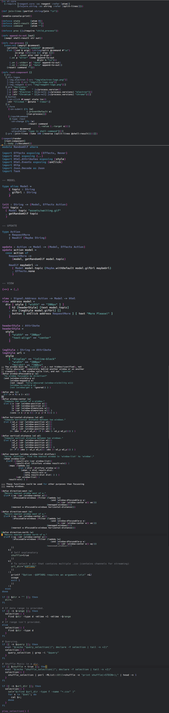
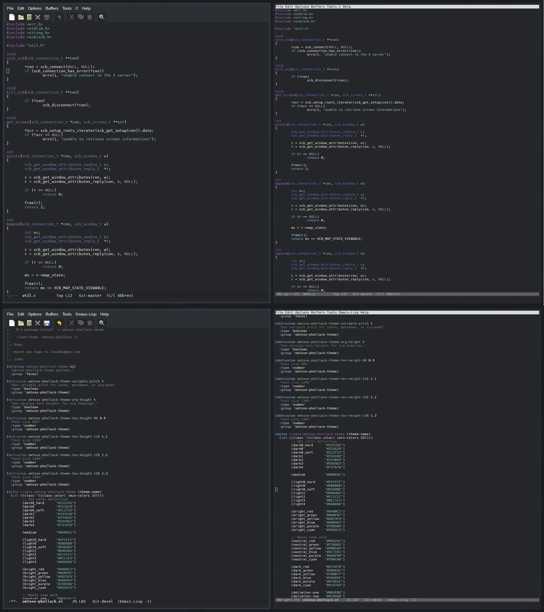

# Omtose Phellack

> '...the cold, almost airless realm of Omtose Phellack.' - Memories of Ice p.252

A dark, soothing theme for Emacs with a cold bluish touch.

Before anyone ask, yes it is named after a kind of magical realm in Malazan Book of The Fallen by Steven Erikson.

### Requirement
Emacs (>= 24.0)

### Screenshots

Emacs GUI and emacsclient -t side by side scrot:

### TODO :
1. Add a bunch of more modes ( ERC, gnus, etc )
2. Need to cleanup the code.
