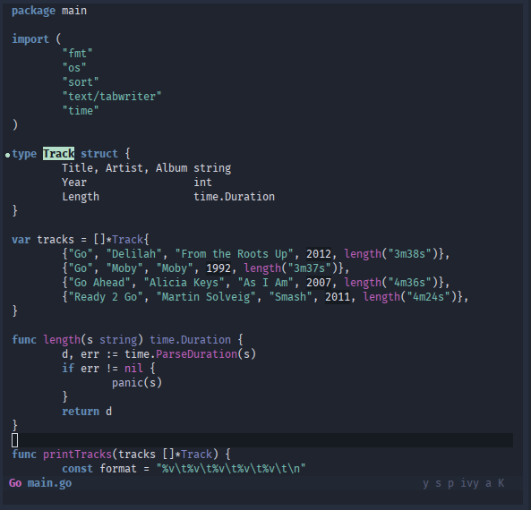
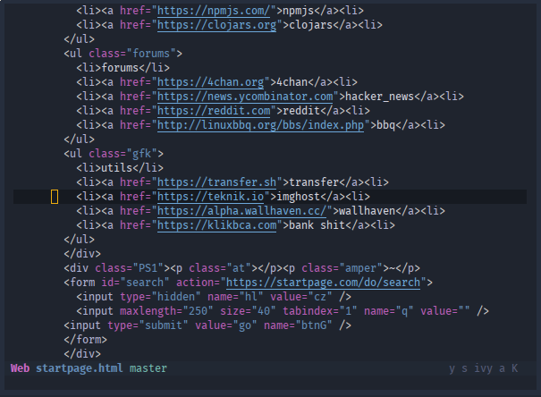
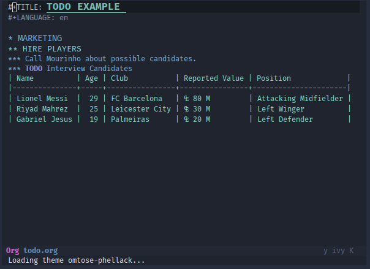
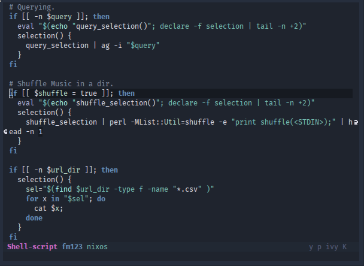
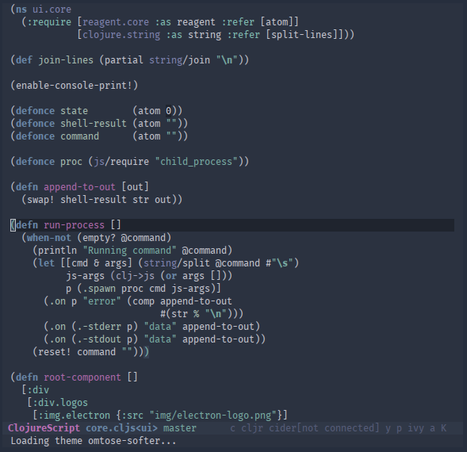
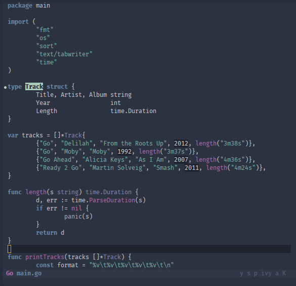
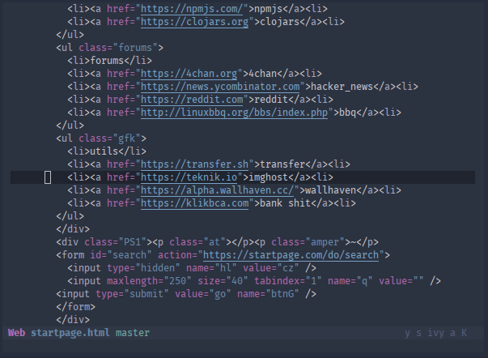
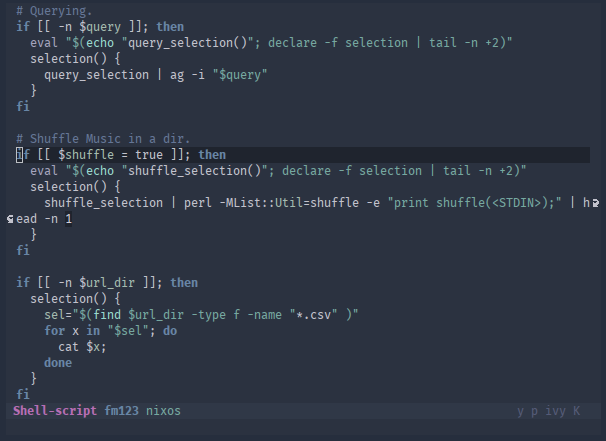

# Omtose Phellack

> '...the cold, almost airless realm of Omtose Phellack.' - Memories of Ice p.252

A dark, soothing theme for Emacs with a cold bluish touch.

Before anyone ask, yes it is named after a kind of magical realm in Malazan Book of The Fallen by Steven Erikson.

### Requirement
Emacs (>= 24.0)

### Installation
install from melpa
    M-x package-install omtose-phellack-theme

then load 'omtose-phellack or 'omtose-softer in your .emacs / init.el / .spacemacs

### Screenshots
#### Omtose darker variant

#### Omtose softer variant

### TODO :
1. Add a bunch of more modes ( ERC, gnus, etc )
2. Terminal colorscheme looks like ass, need some work.
